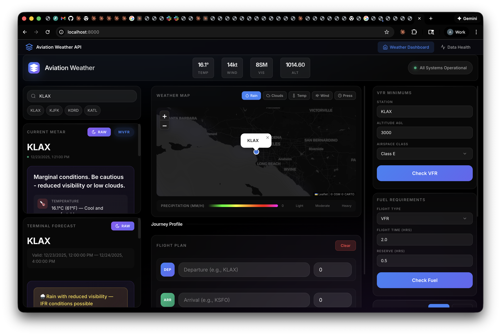
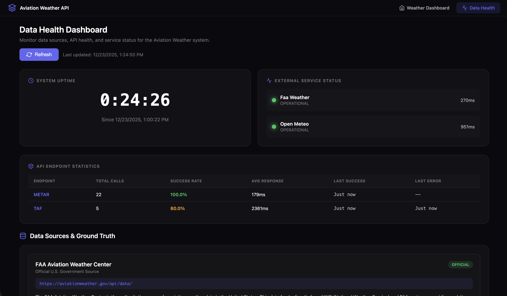

# Skytron Aviation Weather API

**Backend Weather Data Engine for MFD/PFD Integration**



## Overview

The Skytron Aviation Weather API is a **production-ready backend service** designed to power weather widgets and displays across Skytron's avionics suite. Built specifically for integration with Qt/QML-based Multi-Function Displays (MFD) and Primary Flight Displays (PFD), this API serves as the single source of truth for all aviation weather data in the cockpit.

### What It Does

- **Aggregates** weather data from official FAA sources and meteorological services
- **Normalizes** diverse data formats into consistent, Qt/QML-friendly JSON structures
- **Validates** flight conditions against FAA regulations (14 CFR Part 91)
- **Monitors** data source health and API performance in real-time

### Key Features

| Feature | Description |
|---------|-------------|
| **Real-time METAR** | Current airport observations with flight rules (VFR/MVFR/IFR/LIFR) |
| **TAF Forecasts** | Terminal forecasts with human-readable simplified view |
| **Weather Map** | Interactive map with precipitation, cloud, temperature overlays |
| **VFR Compliance** | Automatic visibility and cloud clearance validation by airspace |
| **Journey Planning** | Route weather interpolation for flight planning |
| **Health Monitoring** | Live status of all external data sources |

### Why This Architecture?

The API acts as an **abstraction layer** that shields avionics displays from:
- External API changes and deprecations
- Network latency variability
- Data format inconsistencies
- Service outages (with health monitoring)

This means your Qt/QML widgets receive **clean, predictable data** regardless of upstream changes.

---

## Table of Contents

- [Purpose](#purpose)
- [Architecture Overview](#architecture-overview)
- [Data Sources](#data-sources)
- [API Endpoints](#api-endpoints)
- [Qt/QML Integration Guide](#qtqml-integration-guide)
- [Setup & Installation](#setup--installation)
- [Development](#development)
- [Data Health Monitoring](#data-health-monitoring)

---

## Purpose

This backend serves as the **weather data aggregation layer** between external aviation weather services and Skytron's avionics display systems. It provides:

1. **Unified Data Format** - Normalizes data from multiple sources (FAA, Open-Meteo) into consistent JSON structures optimized for Qt/QML consumption
2. **Real-time Aviation Weather** - METAR observations and TAF forecasts from official FAA sources
3. **Extended Forecasts** - Hourly weather predictions for flight planning beyond TAF coverage
4. **Regulatory Compliance** - Automated VFR/IFR minimums checking against 14 CFR Part 91
5. **Flight Rules Calculation** - Automatic VFR/MVFR/IFR/LIFR determination based on visibility and ceiling

### Use Cases

| Display | Weather Widget | Data Used |
|---------|---------------|-----------|
| **PFD** | Current conditions overlay | METAR (temp, wind, altimeter) |
| **MFD** | Weather radar/map | Map tile overlays, METAR positions |
| **MFD** | Flight planning | TAF, hourly forecasts, route weather |
| **MFD** | Regulatory panel | VFR minimums, fuel requirements |

---

## Architecture Overview

```
┌─────────────────────────────────────────────────────────────────────┐
│                        SKYTRON AVIONICS                             │
│  ┌─────────────┐  ┌─────────────┐  ┌─────────────┐                 │
│  │     PFD     │  │     MFD     │  │   EFB App   │                 │
│  │  (Qt/QML)   │  │  (Qt/QML)   │  │  (Qt/QML)   │                 │
│  └──────┬──────┘  └──────┬──────┘  └──────┬──────┘                 │
│         │                │                │                         │
│         └────────────────┼────────────────┘                         │
│                          │                                          │
│                          ▼                                          │
│              ┌───────────────────────┐                              │
│              │   QML Network Layer   │                              │
│              │   (XMLHttpRequest /   │                              │
│              │    Qt.Network)        │                              │
│              └───────────┬───────────┘                              │
└──────────────────────────┼──────────────────────────────────────────┘
                           │
                           │ HTTP/JSON
                           ▼
┌──────────────────────────────────────────────────────────────────────┐
│                   AVIATION WEATHER API (This Repo)                   │
│                                                                      │
│  ┌────────────────────────────────────────────────────────────────┐ │
│  │                     FastAPI Application                         │ │
│  │  ┌──────────┐ ┌──────────┐ ┌──────────┐ ┌──────────────────┐  │ │
│  │  │  METAR   │ │   TAF    │ │ Forecast │ │   Regulations    │  │ │
│  │  │ Endpoint │ │ Endpoint │ │ Endpoint │ │    Endpoints     │  │ │
│  │  └────┬─────┘ └────┬─────┘ └────┬─────┘ └────────┬─────────┘  │ │
│  │       │            │            │                │             │ │
│  │       ▼            ▼            ▼                ▼             │ │
│  │  ┌─────────────────────────────────────────────────────────┐  │ │
│  │  │              Data Normalization Layer                    │  │ │
│  │  │  • Flight rules calculation (VFR/MVFR/IFR/LIFR)         │  │ │
│  │  │  • Unit conversions                                      │  │ │
│  │  │  • Timestamp standardization (ISO 8601)                  │  │ │
│  │  │  • Cloud layer parsing                                   │  │ │
│  │  └─────────────────────────────────────────────────────────┘  │ │
│  └────────────────────────────────────────────────────────────────┘ │
│                                                                      │
│  ┌────────────────────────────────────────────────────────────────┐ │
│  │                    Health Tracking Layer                        │ │
│  │  • API call statistics    • Response time monitoring           │ │
│  │  • Success/failure rates  • External service health checks     │ │
│  └────────────────────────────────────────────────────────────────┘ │
└──────────────────────────────────────────────────────────────────────┘
                           │
                           │ HTTPS
                           ▼
┌──────────────────────────────────────────────────────────────────────┐
│                      EXTERNAL DATA SOURCES                           │
│                                                                      │
│  ┌─────────────────────┐  ┌─────────────────────┐                   │
│  │   FAA Aviation WX   │  │     Open-Meteo      │                   │
│  │  (aviationweather   │  │   (api.open-meteo   │                   │
│  │      .gov)          │  │       .com)         │                   │
│  │                     │  │                     │                   │
│  │  • METAR (raw/JSON) │  │  • Hourly forecasts │                   │
│  │  • TAF (raw/JSON)   │  │  • Temperature      │                   │
│  │  • Station info     │  │  • Wind/Pressure    │                   │
│  └─────────────────────┘  └─────────────────────┘                   │
│                                                                      │
│  ┌─────────────────────┐  ┌─────────────────────┐                   │
│  │  OpenWeatherMap     │  │   FAA Regulations   │                   │
│  │  (tile.openweather  │  │   (14 CFR Part 91)  │                   │
│  │      map.org)       │  │                     │                   │
│  │                     │  │  • 91.155 VFR mins  │                   │
│  │  • Weather map tiles│  │  • 91.151 VFR fuel  │                   │
│  │  • Radar overlays   │  │  • 91.167 IFR fuel  │                   │
│  └─────────────────────┘  └─────────────────────┘                   │
└──────────────────────────────────────────────────────────────────────┘
```

---

## Data Sources

| Source | Type | Data Provided | Update Frequency |
|--------|------|---------------|------------------|
| **FAA Aviation Weather** | Official | METAR, TAF, station info | METAR: Hourly, TAF: 6-hourly |
| **Open-Meteo** | Third-party | Hourly forecasts, extended weather | Hourly |
| **OpenWeatherMap** | Third-party | Map tile overlays | ~10-15 minutes |
| **14 CFR Part 91** | Reference | VFR minimums, fuel requirements | Static |

### Data Integrity

- All aviation-critical data (METAR, TAF) comes from **official FAA sources**
- Flight rules (VFR/MVFR/IFR/LIFR) are calculated using FAA-standard criteria
- Regulation checks are based on **14 CFR Part 91** requirements
- No caching on critical weather data - always live fetch

---

## API Endpoints

### Base URL
```
http://localhost:8000/api
```

### Aviation Weather

#### GET `/api/aviation/metar/{station}`
Get current METAR observation for an airport.

**Parameters:**
- `station` (path) - ICAO code (e.g., `KLAX`, `KJFK`) or 3-letter code (auto-converts)

**Response:**
```json
{
  "station": "KLAX",
  "observation_time": "2025-01-15T14:53:00+00:00",
  "raw_text": "KLAX 151453Z 25010KT 10SM FEW020 SCT200 18/12 A3002",
  "temperature": 18,
  "dewpoint": 12,
  "wind_direction": 250,
  "wind_speed": 10,
  "wind_gust": null,
  "visibility": 10.0,
  "altimeter": 30.02,
  "flight_rules": "VFR",
  "sky_conditions": [
    {"cover": "FEW", "base": 2000},
    {"cover": "SCT", "base": 20000}
  ],
  "remarks": "AO2 SLP165 T01830122"
}
```

#### GET `/api/aviation/taf/{station}`
Get Terminal Aerodrome Forecast.

**Response:**
```json
{
  "station": "KLAX",
  "issue_time": "2025-01-15T12:00:00+00:00",
  "valid_period_start": "2025-01-15T12:00:00+00:00",
  "valid_period_end": "2025-01-16T18:00:00+00:00",
  "raw_text": "TAF KLAX 151138Z 1512/1618 25012KT P6SM FEW025...",
  "forecast_periods": [...]
}
```

### Weather Forecasts

#### GET `/api/weather/forecast`
Get hourly weather forecast for a location.

**Parameters:**
- `lat` (query) - Latitude
- `lon` (query) - Longitude
- `hours` (query, optional) - Number of hours (default: 24, max: 48)

**Response:**
```json
[
  {
    "timestamp": "2025-01-15T15:00:00+00:00",
    "temperature_2m": 65.3,
    "wind_speed_10m": 12.5,
    "wind_direction_10m": 245,
    "cloud_cover": 25,
    "pressure_msl": 1015.2,
    "precipitation": 0.0
  }
]
```

### Regulatory Compliance

#### GET `/api/regulations/check/vfr`
Check current conditions against VFR minimums.

**Parameters:**
- `station` (query) - ICAO code
- `altitude_agl` (query) - Planned altitude AGL in feet
- `airspace_class` (query) - Airspace class (B, C, D, E, G)

**Response:**
```json
[
  {
    "regulation": "14 CFR 91.155 - VFR Visibility Minimum",
    "status": "COMPLIANT",
    "criteria": {"minimum_visibility_sm": 3.0, "airspace_class": "E"},
    "current_values": {"visibility_sm": 10.0},
    "compliant": true,
    "notes": "Current visibility: 10.0 SM, Required: 3.0 SM"
  },
  {
    "regulation": "14 CFR 91.155 - VFR Cloud Clearance",
    "status": "COMPLIANT",
    "criteria": {"requirement": "500 ft below, 1,000 ft above, 2,000 ft horizontal"},
    "current_values": {"ceiling_ft": 8000, "lowest_cloud_ft": 2000},
    "compliant": true,
    "notes": "Ceiling at 8,000 ft AGL. Your altitude 3,500 ft. Clearance: 4,500 ft"
  }
]
```

#### GET `/api/regulations/check/fuel`
Check fuel reserve requirements.

**Parameters:**
- `flight_type` (query) - `VFR` or `IFR`
- `flight_time_hours` (query) - Planned flight time
- `reserve_fuel_hours` (query) - Reserve fuel carried

### Station Search

#### GET `/api/stations/search`
Search for weather stations by name or ICAO code.

**Parameters:**
- `query` (query) - Search term

### Health & Monitoring

#### GET `/health`
Basic health check.

#### GET `/api/data-health`
Comprehensive data health statistics including API call counts, success rates, and external service status.

---

## Qt/QML Integration Guide

### Network Layer Setup

Create a reusable weather service component:

```qml
// WeatherService.qml
import QtQuick 2.15

QtObject {
    id: weatherService

    property string baseUrl: "http://localhost:8000/api"
    property bool loading: false
    property var lastError: null

    signal metarReceived(var data)
    signal tafReceived(var data)
    signal forecastReceived(var data)
    signal errorOccurred(string message)

    function fetchMetar(station) {
        loading = true
        var xhr = new XMLHttpRequest()
        xhr.open("GET", baseUrl + "/aviation/metar/" + station)
        xhr.onreadystatechange = function() {
            if (xhr.readyState === XMLHttpRequest.DONE) {
                loading = false
                if (xhr.status === 200) {
                    var data = JSON.parse(xhr.responseText)
                    metarReceived(data)
                } else {
                    lastError = xhr.statusText
                    errorOccurred("Failed to fetch METAR: " + xhr.statusText)
                }
            }
        }
        xhr.send()
    }

    function fetchTaf(station) {
        loading = true
        var xhr = new XMLHttpRequest()
        xhr.open("GET", baseUrl + "/aviation/taf/" + station)
        xhr.onreadystatechange = function() {
            if (xhr.readyState === XMLHttpRequest.DONE) {
                loading = false
                if (xhr.status === 200) {
                    var data = JSON.parse(xhr.responseText)
                    tafReceived(data)
                } else {
                    lastError = xhr.statusText
                    errorOccurred("Failed to fetch TAF: " + xhr.statusText)
                }
            }
        }
        xhr.send()
    }

    function fetchForecast(lat, lon, hours) {
        hours = hours || 24
        loading = true
        var xhr = new XMLHttpRequest()
        xhr.open("GET", baseUrl + "/weather/forecast?lat=" + lat + "&lon=" + lon + "&hours=" + hours)
        xhr.onreadystatechange = function() {
            if (xhr.readyState === XMLHttpRequest.DONE) {
                loading = false
                if (xhr.status === 200) {
                    var data = JSON.parse(xhr.responseText)
                    forecastReceived(data)
                } else {
                    lastError = xhr.statusText
                    errorOccurred("Failed to fetch forecast: " + xhr.statusText)
                }
            }
        }
        xhr.send()
    }

    function checkVfrMinimums(station, altitudeAgl, airspaceClass) {
        var xhr = new XMLHttpRequest()
        var url = baseUrl + "/regulations/check/vfr?station=" + station
                  + "&altitude_agl=" + altitudeAgl
                  + "&airspace_class=" + airspaceClass
        xhr.open("GET", url)
        xhr.onreadystatechange = function() {
            if (xhr.readyState === XMLHttpRequest.DONE) {
                if (xhr.status === 200) {
                    return JSON.parse(xhr.responseText)
                }
            }
        }
        xhr.send()
    }
}
```

### PFD Weather Widget Example

```qml
// PFDWeatherWidget.qml
import QtQuick 2.15
import QtQuick.Controls 2.15

Rectangle {
    id: weatherWidget
    width: 200
    height: 120
    color: "#1a1a2e"
    radius: 8

    property string station: "KLAX"
    property var metarData: null

    WeatherService {
        id: weatherService
        onMetarReceived: function(data) {
            metarData = data
        }
        onErrorOccurred: function(msg) {
            console.warn("Weather error:", msg)
        }
    }

    Column {
        anchors.fill: parent
        anchors.margins: 12
        spacing: 8

        // Station and Flight Rules
        Row {
            spacing: 8
            Text {
                text: station
                color: "white"
                font.pixelSize: 16
                font.bold: true
            }
            Rectangle {
                width: 40
                height: 20
                radius: 4
                color: getFlightRulesColor(metarData?.flight_rules)
                Text {
                    anchors.centerIn: parent
                    text: metarData?.flight_rules || "--"
                    color: "white"
                    font.pixelSize: 11
                    font.bold: true
                }
            }
        }

        // Temperature
        Row {
            spacing: 4
            Text { text: "TEMP"; color: "#888"; font.pixelSize: 10 }
            Text {
                text: metarData?.temperature !== null ? metarData.temperature + "°C" : "--"
                color: "white"
                font.pixelSize: 14
            }
        }

        // Wind
        Row {
            spacing: 4
            Text { text: "WIND"; color: "#888"; font.pixelSize: 10 }
            Text {
                text: formatWind(metarData)
                color: "white"
                font.pixelSize: 14
            }
        }

        // Altimeter
        Row {
            spacing: 4
            Text { text: "ALTM"; color: "#888"; font.pixelSize: 10 }
            Text {
                text: metarData?.altimeter ? metarData.altimeter.toFixed(2) + " inHg" : "--"
                color: "white"
                font.pixelSize: 14
            }
        }
    }

    function getFlightRulesColor(rules) {
        switch(rules) {
            case "VFR": return "#22c55e"
            case "MVFR": return "#3b82f6"
            case "IFR": return "#ef4444"
            case "LIFR": return "#a855f7"
            default: return "#666"
        }
    }

    function formatWind(data) {
        if (!data || data.wind_speed === null) return "--"
        var dir = data.wind_direction !== null ? data.wind_direction + "°" : "VRB"
        var spd = data.wind_speed + "kt"
        var gust = data.wind_gust ? " G" + data.wind_gust : ""
        return dir + " @ " + spd + gust
    }

    // Auto-refresh every 5 minutes
    Timer {
        interval: 300000
        running: true
        repeat: true
        triggeredOnStart: true
        onTriggered: weatherService.fetchMetar(station)
    }
}
```

### MFD Weather Panel Example

```qml
// MFDWeatherPanel.qml
import QtQuick 2.15
import QtQuick.Controls 2.15
import QtQuick.Layouts 1.15

Rectangle {
    id: weatherPanel
    color: "#0a0a0f"

    property string currentStation: "KLAX"
    property var metarData: null
    property var tafData: null
    property var forecastData: []

    WeatherService {
        id: weatherService
        onMetarReceived: metarData = data
        onTafReceived: tafData = data
        onForecastReceived: forecastData = data
    }

    ColumnLayout {
        anchors.fill: parent
        anchors.margins: 16
        spacing: 16

        // Header with station selector
        RowLayout {
            Layout.fillWidth: true

            TextField {
                id: stationInput
                placeholderText: "ICAO Code"
                text: currentStation
                Layout.preferredWidth: 100
                onAccepted: {
                    currentStation = text.toUpperCase()
                    refreshAll()
                }
            }

            Button {
                text: "Refresh"
                onClicked: refreshAll()
            }

            Item { Layout.fillWidth: true }

            // Flight rules badge
            Rectangle {
                width: 60
                height: 28
                radius: 6
                color: getFlightRulesColor(metarData?.flight_rules)
                Text {
                    anchors.centerIn: parent
                    text: metarData?.flight_rules || "--"
                    color: "white"
                    font.bold: true
                }
            }
        }

        // METAR Display
        Rectangle {
            Layout.fillWidth: true
            Layout.preferredHeight: 100
            color: "#1a1a2e"
            radius: 8

            Column {
                anchors.fill: parent
                anchors.margins: 12
                spacing: 8

                Text {
                    text: "CURRENT CONDITIONS"
                    color: "#666"
                    font.pixelSize: 11
                    font.bold: true
                }

                Text {
                    text: metarData?.raw_text || "No data"
                    color: "white"
                    font.family: "monospace"
                    font.pixelSize: 12
                    wrapMode: Text.Wrap
                    width: parent.width
                }
            }
        }

        // TAF Display
        Rectangle {
            Layout.fillWidth: true
            Layout.preferredHeight: 120
            color: "#1a1a2e"
            radius: 8

            Column {
                anchors.fill: parent
                anchors.margins: 12
                spacing: 8

                Text {
                    text: "TERMINAL FORECAST"
                    color: "#666"
                    font.pixelSize: 11
                    font.bold: true
                }

                Text {
                    text: tafData?.raw_text || "No data"
                    color: "white"
                    font.family: "monospace"
                    font.pixelSize: 11
                    wrapMode: Text.Wrap
                    width: parent.width
                }
            }
        }

        // Spacer
        Item { Layout.fillHeight: true }
    }

    function refreshAll() {
        weatherService.fetchMetar(currentStation)
        weatherService.fetchTaf(currentStation)
    }

    function getFlightRulesColor(rules) {
        switch(rules) {
            case "VFR": return "#22c55e"
            case "MVFR": return "#3b82f6"
            case "IFR": return "#ef4444"
            case "LIFR": return "#a855f7"
            default: return "#666"
        }
    }

    Component.onCompleted: refreshAll()
}
```

### C++ Backend Integration (Optional)

For production deployments, consider using Qt's C++ network classes for better performance:

```cpp
// WeatherClient.h
#ifndef WEATHERCLIENT_H
#define WEATHERCLIENT_H

#include <QObject>
#include <QNetworkAccessManager>
#include <QJsonObject>

class WeatherClient : public QObject
{
    Q_OBJECT
    Q_PROPERTY(QString baseUrl READ baseUrl WRITE setBaseUrl NOTIFY baseUrlChanged)
    Q_PROPERTY(bool loading READ loading NOTIFY loadingChanged)

public:
    explicit WeatherClient(QObject *parent = nullptr);

    QString baseUrl() const;
    void setBaseUrl(const QString &url);
    bool loading() const;

    Q_INVOKABLE void fetchMetar(const QString &station);
    Q_INVOKABLE void fetchTaf(const QString &station);
    Q_INVOKABLE void fetchForecast(double lat, double lon, int hours = 24);

signals:
    void baseUrlChanged();
    void loadingChanged();
    void metarReceived(const QJsonObject &data);
    void tafReceived(const QJsonObject &data);
    void forecastReceived(const QJsonArray &data);
    void errorOccurred(const QString &message);

private:
    QNetworkAccessManager *m_manager;
    QString m_baseUrl;
    bool m_loading;
};

#endif
```

### Registering with QML

```cpp
// main.cpp
#include <QGuiApplication>
#include <QQmlApplicationEngine>
#include "WeatherClient.h"

int main(int argc, char *argv[])
{
    QGuiApplication app(argc, argv);

    qmlRegisterType<WeatherClient>("Skytron.Weather", 1, 0, "WeatherClient");

    QQmlApplicationEngine engine;
    engine.load(QUrl(QStringLiteral("qrc:/main.qml")));

    return app.exec();
}
```

---

## Setup & Installation

### Prerequisites

- Python 3.9+
- pip

### Installation

```bash
# Clone the repository
git clone <repository-url>
cd avionics-weather-api

# Create virtual environment
python3 -m venv venv
source venv/bin/activate  # On Windows: venv\Scripts\activate

# Install dependencies
pip install fastapi uvicorn httpx pydantic

# Run the server
uvicorn app.main:app --reload --host 0.0.0.0 --port 8000
```

### Production Deployment

For production, run without `--reload`:

```bash
uvicorn app.main:app --host 0.0.0.0 --port 8000 --workers 4
```

### Environment Configuration

The API can be configured via environment variables:

| Variable | Default | Description |
|----------|---------|-------------|
| `HOST` | `0.0.0.0` | Server bind address |
| `PORT` | `8000` | Server port |
| `WORKERS` | `1` | Number of worker processes |

---

## Development

### Project Structure

```
avionics-weather-api/
├── app/
│   ├── main.py              # FastAPI application & endpoints
│   └── static/
│       ├── index.html       # Web dashboard (development)
│       └── health.html      # Data health dashboard
├── venv/                    # Python virtual environment
├── README.md               # This file
└── requirements.txt        # Python dependencies
```

### API Documentation

FastAPI provides automatic interactive documentation:

- **Swagger UI**: http://localhost:8000/docs
- **ReDoc**: http://localhost:8000/redoc

### Adding New Endpoints

1. Add the endpoint function in `app/main.py`
2. Define request/response models using Pydantic
3. Add health tracking if it's a data-fetching endpoint
4. Document the endpoint in this README

---

## Data Health Monitoring

Access the data health dashboard at: **http://localhost:8000/health-dashboard**



This provides:

- **System Uptime** - How long the API has been running
- **External Service Status** - Live connectivity checks to FAA and Open-Meteo
- **API Endpoint Statistics** - Call counts, success rates, response times
- **Data Source Documentation** - What data comes from where

### Health API

For programmatic monitoring:

```bash
# Basic health check
curl http://localhost:8000/health

# Detailed health data
curl http://localhost:8000/api/data-health
```

---

## Flight Rules Reference

The API calculates flight rules based on FAA criteria:

| Category | Ceiling | Visibility |
|----------|---------|------------|
| **VFR** | > 3,000 ft AGL | > 5 SM |
| **MVFR** | 1,000 - 3,000 ft | 3 - 5 SM |
| **IFR** | 500 - 1,000 ft | 1 - 3 SM |
| **LIFR** | < 500 ft | < 1 SM |

---

## Support

For questions or issues:

1. Check the `/health-dashboard` for service status
2. Review API documentation at `/docs`
3. Contact the Skytron development team

---

**Skytron Aviation Systems** | Internal Documentation
